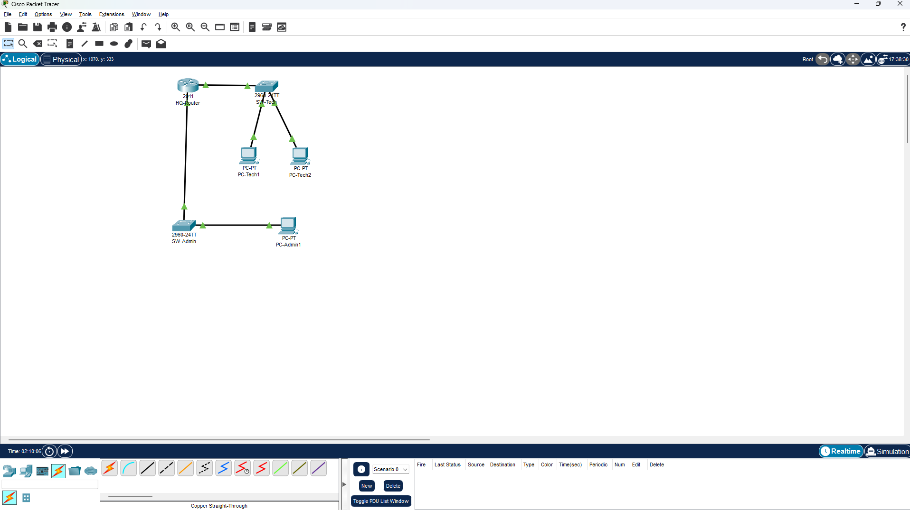

# Network-Simulation-Project: Router, Switches, PCs with ACL
## Overview
This project simulates a simple office network using Cisco Packet Tracer. It demonstrates key networking concepts including IP addressing, subnetting, device configuration, routing, and security with Access Control Lists (ACLs).

## Project Components and Concepts

### 1. Network Devices  
The project uses essential network devices to simulate a realistic environment:  
- **Router:** Connects multiple networks (subnets), routes traffic between them, and acts as the gateway for connected devices. 
- **Switches:** Connect multiple devices within the same subnet, forwarding data frames locally.  
- **PCs:** End-user devices representing users/workstations connected to the network.

### 2. Network Topology  
- Simple hierarchical star topology.  
- Router is central, connecting two separate switches.  
- Switches connect PCs in different subnets, illustrating subnet segmentation and inter-network communication.

### 3. IP Addressing Scheme
| Device   | Interface       | IP Address      | Subnet Mask     | Default Gateway  |
|----------|-----------------|-----------------|-----------------|------------------|
| Router   | GigabitEthernet0/0 | 192.168.10.1  | 255.255.255.0   | -                |
| Router   | GigabitEthernet0/1 | 192.168.20.1  | 255.255.255.0   | -                |
| Tech1 PC | NIC             | 192.168.10.10   | 255.255.255.0   | 192.168.10.1     |
| Tech2 PC | NIC             | 192.168.10.11   | 255.255.255.0   | 192.168.10.1     |
| Admin1 PC| NIC             | 192.168.20.10   | 255.255.255.0   | 192.168.20.1     |

- Unique IP addresses for each device.  
- Router interfaces assigned IPs matching their subnets.  
- PCs have static IPs within subnet ranges.  
- Subnet masks define network and host portions, enabling segmentation.

  ### 4. Subnetworks (Subnets)  
- Logical grouping for management and security.  
- **Tech subnet:** 192.168.10.0/24 for technical staff PCs.  
- **Admin subnet:** 192.168.20.0/24 for administrative PCs.  
- Limits broadcast traffic and enforces security policies.

### 5. Default Gateway Configuration  
- Router interfaces serve as gateways for subnets.  
- PCs set their gateway to router IPs to enable cross-subnet communication.

### 6. Basic Device Configuration  
- Hostnames assigned for clarity (e.g., Router_Main, Switch_Tech).  
- Router interfaces configured with IP addresses.  
- Interfaces enabled (`no shutdown`).  
- Connectivity verified using `ping` and interface status commands.

### 7. VLANs (Optional)  
- VLANs provide logical segmentation within physical switches.  
- Can isolate PCs even on the same physical switch to improve security.

### 8. Routing  
- Router routes packets between different subnets.  
- Enables communication between devices in different VLANs/subnets.

### 9. Access Control Lists (ACLs)  
- ACLs filter traffic by IP addresses and protocols to enforce security.  
- Admin subnet granted full access to all devices.  
- Tech subnet restricted from accessing admin subnet.  
- Other traffic permitted as necessary.

### 10. Troubleshooting + debugging
- Verified connectivity using 'ping'
- Checked interface statuses with show 'ip interface brief'.
- Monitored ACL hits to confirm rule application.
- Adjusted configurations based on observed network behavior.

### 11. Security Concepts
- Role-based access control with ACLs limits unauthorized access.
- Network segmentation confines potential security issues.
- Router ACLs provide perimeter security between subnets.

### 12. Cisco IOS CLI
- Configured all devices using Cisco CLI commands.
- Used different configuration modes: privileged exec, global config, interface config.

### 13. Network Simulation Tool
- Used Cisco Packet Tracer to build and simulate the network.
- Visualized topology and tested ACL rules and traffic flow.
